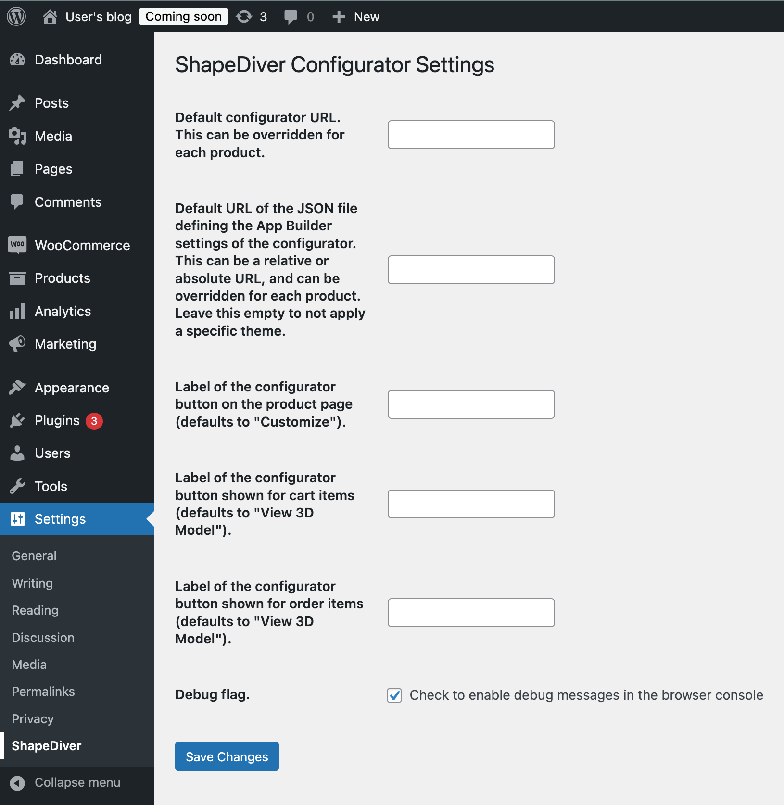
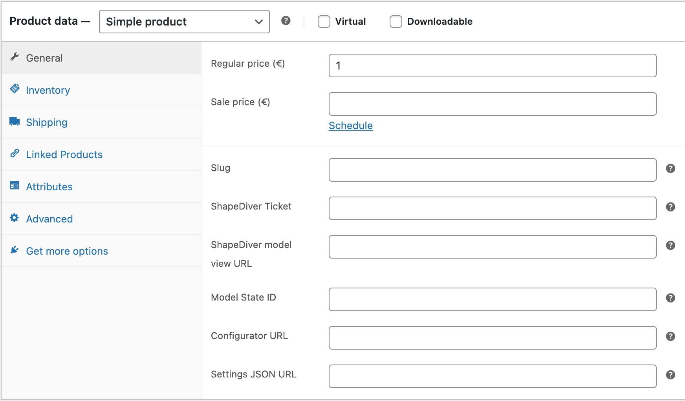
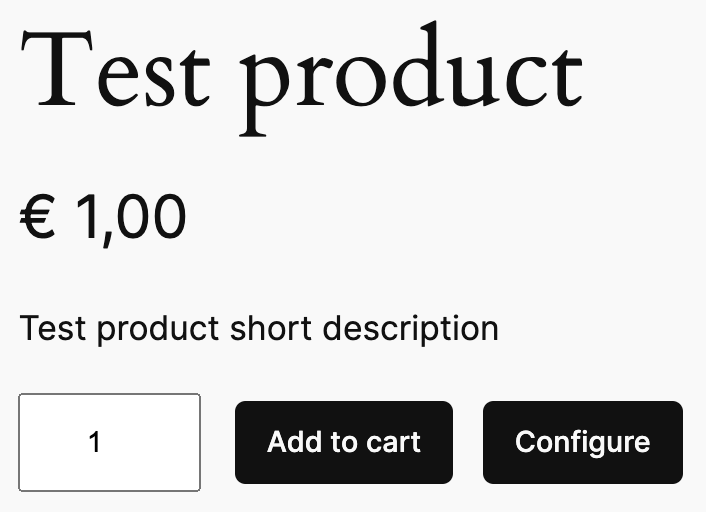

# ShapeDiver WordPress Plugin

This plugin integrates 3D Configurators built using [ShapeDiver App Builder](https://help.shapediver.com/doc/shapediver-app-builder) into WordPress and WooCommerce. 

## Project Overview

The ShapeDiver WordPress Plugin is designed to enhance WordPress and WooCommerce sites with ShapeDiver's 3D model visualization capabilities. This plugin allows for seamless integration of ShapeDiver's technology into your WordPress environment.

## Features

- Integration with WordPress and WooCommerce
- 3D configuration and visualisation powered by ShapeDiver
- Easy installation and configuration

## How to use the plugin

Use the plugin manager of WordPress to install the plugin. If you received the plugin as a zip file, use `Add New Plugin -> Upload Plugin`. 
We plan to add the plugin to the WordPress plugin directory, which will make the plugin available publicly. 

### Plugin Settings

Once the plugin has been installed, you can configure global settings by navigating to `Settings -> ShapeDiver`. 
All of the settings are optional.  

### Product Settings

The plugin exposes settings on the "General" tab of the product edit page. 
Please see the tooltips for an explanation of the available settings. 

A button labelled "Customize" will be shown on the product page if a configurator is available. 
The button's label can be changed in the plugin settings. It will be disabled while loading the configurator as 
an iframe in the background. Clicking the button opens the configurator. The configurator overlays the page and
should contain a "Close configurator" button. While developing a configurator this button might be missing. If so, press the Escape
button quickly three times in a row to close the configurator. 

### Shortcode for configurator button

When using a custom theme, the plugin might not be able to automatically add the configurator button. In this case, you can use the 
`[sd_configurator_button]` shortcode to place the button on the product page. The shortcode supports the following optional attributes: 

  * `label`: Button text
  * `class`: CSS classes to assign to the button

Example: `[sd_configurator_button label="My button text" class="myclass other-class yet_another_class"]`

## Development Setup

### Prerequisites

- [pnpm](https://pnpm.io/)
- [Node.js v20](https://nodejs.org/en/about/previous-releases)
- Docker and [Docker Compose](https://docs.docker.com/compose/install/)

### Getting Started

1. Clone the repository
2. Install dependencies: `pnpm install`
3. Build the plugin: `pnpm run build`
4. Copy `docker-compose.template.yml` to `docker-compose.yml`
5. Create and start the container: `pnpm run wp:start`
6. Navigate to `http://localhost:8080` and wait until WordPress is running
7. Uncomment the line in `docker-compose.yml` that mounts the plugin
8. Restart the container: `pnpm run wp:restart`

In general, whenever you want to refresh the container using local code changes, 
carry out the following steps: 

1. Build the plugin: `pnpm run build`
2. Restart the container: `pnpm run wp:restart`

### Development Commands

The following scripts are available for development:

- `pnpm run wp:start`: Create the container if it hasn't been created before
- `pnpm run wp:stop`: Stop the container
- `pnpm run wp:restart`: Same as `wp:stop` followed by `wp:start`
- `pnpm run wp:reset`: CAUTION! Recreates the containers, your data stored in WordPress will be lost!
- `pnpm run wp:status`: Show docker status
- `pnpm run dev:status`: Check the status of the development environment
- `pnpm run build`: Build and bundle the plugin for production
- `pnpm run start`: Standalone development mode of the plugin (without WordPress)
- `pnpm run optimize`: Optimized build for production

### Docker Environment

The project uses Docker for local development. The `docker-compose.yml` file sets up:

- A MariaDB database
- A WordPress instance with the plugin directory mounted

To access the WordPress site, visit `http://localhost:8080` after starting the development environment.

## Building the Plugin

To build the plugin for production:

1. Run `pnpm run build` or `./build.sh`
2. The script will:
   - Compile TypeScript to JavaScript
   - Copy necessary PHP and CSS files
   - Create a zip archive of the plugin

The resulting zip file can be found in the project root directory.

## License

This project is licensed under the GPL v2 license.

## Author

ShapeDiver GmbH

# TODO 

  * Configurator button - feedback in case of configurator not connecting
  * development mode - possibility to save model state to product
