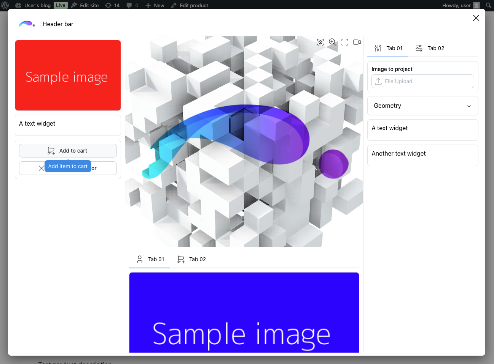
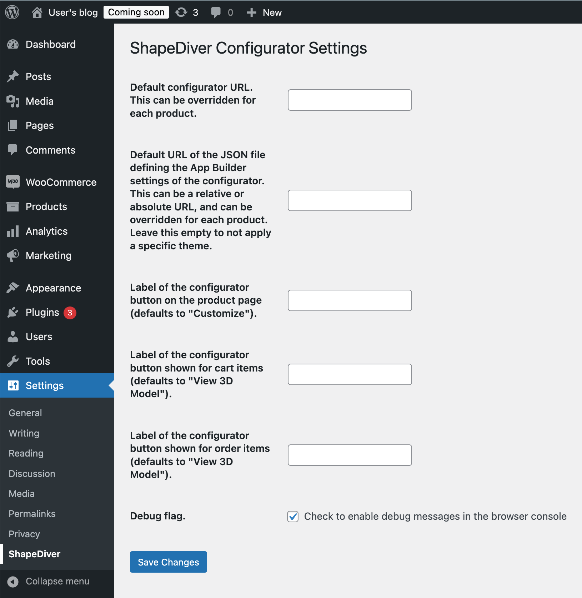
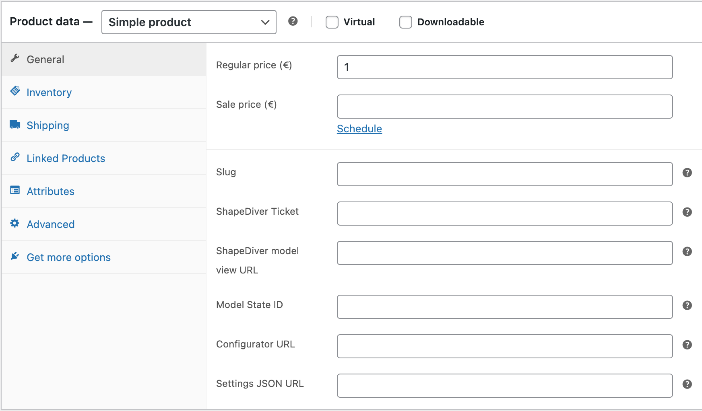
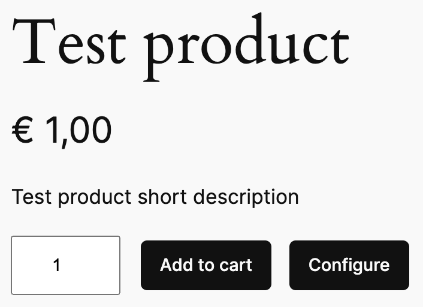

# ShapeDiver WordPress Plugin

This plugin integrates 3D Configurators built using [ShapeDiver App Builder](https://help.shapediver.com/doc/shapediver-app-builder) into WordPress and WooCommerce. 

The App Builder features of ShapeDiver allow you to create ShapeDiver Apps - flexible, customizable single-page 3D web applications - using only Grasshopper. The ShapeDiver WordPress Plugin allows you to easily integrate ShapeDiver Apps into your WooCommerce store. 

Link ShapeDiver Apps to your products and let your customers configure and visualize your products in 3D. If you have configured a ShapeDiver App for a product, it opens as overlay on the product page. Using the custom “Add To Cart” action component for App Builder, users can play with the configurator and add their configured product to the cart.

## How to use the plugin

Use the plugin manager of WordPress to install the plugin. Although we plan to do so, the plugin is not yet available via the WordPress plugin directory. Therefore please [download](https://github.com/shapediver/WordPressPlugin/releases) the plugin as a zip file, and use `Add New Plugin -> Upload Plugin`. 

### Plugin Settings

Once the plugin has been installed, you can configure global settings by navigating to `Settings -> ShapeDiver`. 
All of the settings are optional.  

### Product Settings

The plugin exposes settings on the "General" tab of the product edit page. 
Please see the tooltips for an explanation of the available settings. 

Typically you define the `slug` of the model you want to link to the product. As a prerequisite, you need to enable [iframe embedding](https://help.shapediver.com/doc/iframe-settings) for your model. Make sure to whitelist your domain(s) in your [embedding settings](https://help.shapediver.com/doc/setup-domains-for-embedding). 

As an alternative, you can specify `ticket` and `modelViewUrl` instead of the `slug`.  This requires [direct embedding](https://help.shapediver.com/doc/developers-settings) to be enabled for your model, and [strong authorization](https://help.shapediver.com/doc/developers-settings) to be disabled. As a result, the protection of your model will be less strict, but the model will load significantly faster.

The optional `Model State ID` allows you to define a state of parameters that should be loaded initially, instead of the model's default parameter values. 

You can customize the theme used by App Builder by specifying a `Settings JSON URL`. This also provides you with access to several advanced features of App Builder. Read more about the possibilities in our [help center](https://help.shapediver.com/doc/customize-a-theme). 

A button labelled "Customize" will be shown on the product page if a configurator is available. 
The button's label can be changed in the plugin settings. It will be disabled while loading the configurator as 
an iframe in the background. Clicking the button opens the configurator. The configurator overlays the page and
should contain a "Close configurator" button. While developing a configurator this button might be missing. If so, press the Escape
button quickly three times in a row to close the configurator. 

### Shortcode for configurator button

When using a custom theme, the plugin might not be able to automatically add the configurator button. In this case, you can use the 
`[sd_configurator_button]` shortcode to place the button on the product page. The shortcode supports the following optional attributes: 

  * `label`: Button text
  * `class`: CSS classes to assign to the button

Example: `[sd_configurator_button label="My button text" class="myclass other-class yet_another_class"]`

## Development Setup

### Prerequisites

- [pnpm](https://pnpm.io/)
- [Node.js v20](https://nodejs.org/en/about/previous-releases)
- Docker and [Docker Compose](https://docs.docker.com/compose/install/)

### Getting Started

1. Clone the repository
2. Install dependencies: `pnpm install`
3. Build the plugin: `pnpm run build`
4. Copy `docker-compose.template.yml` to `docker-compose.yml`
5. Create and start the container: `pnpm run wp:start`
6. Navigate to `http://localhost:8080` and wait until WordPress is running
7. Uncomment the line that mounts the plugin in `docker-compose.yml`
8. Restart the container: `pnpm run wp:restart`

In general, whenever you want to refresh the container using local code changes, 
carry out the following steps: 

1. Build the plugin: `pnpm run build`
2. Restart the container: `pnpm run wp:restart`

Hint: The default WordPress user name is `user`, the default password is `bitnami`. 

### Development Commands

The following scripts are available for development:

- `pnpm run wp:start`: Create the container if it hasn't been created before
- `pnpm run wp:stop`: Stop the container
- `pnpm run wp:restart`: Same as `wp:stop` followed by `wp:start`
- `pnpm run wp:reset`: CAUTION! Recreates the containers, your data stored in WordPress will be lost!
- `pnpm run wp:status`: Show docker status
- `pnpm run dev:status`: Check the status of the development environment
- `pnpm run build`: Build and bundle the plugin for production
- `pnpm run start`: Standalone development mode of the plugin (without WordPress)
- `pnpm run optimize`: Optimized build for production

### Docker Environment

The project uses Docker for local development. The `docker-compose.yml` file sets up:

- A MariaDB database
- A WordPress instance with the plugin directory mounted

To access the WordPress site, visit `http://localhost:8080` after starting the development environment.

## Building the Plugin

To build the plugin for production:

1. Run `pnpm run build` or `./build.sh`
2. The script will:
   - Compile TypeScript to JavaScript
   - Copy necessary PHP and CSS files
   - Create a zip archive of the plugin

The resulting zip file can be found in the project root directory.

## License

This project is licensed under the GPL v2 license.

## Author

ShapeDiver GmbH
